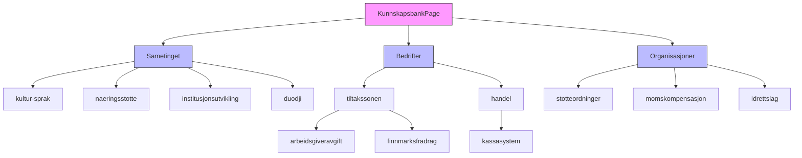
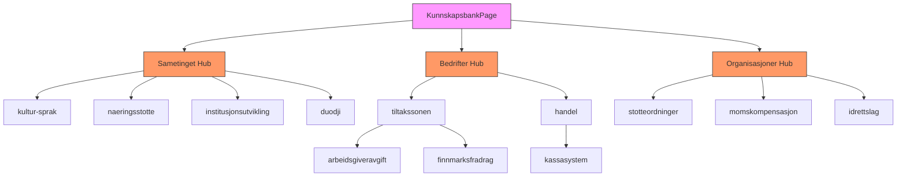
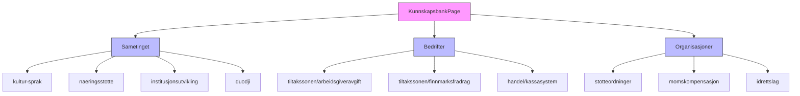

# Kunnskapsbank Architecture

## Current Architecture Diagram



## Proposed Architecture Options

### Option 1: Minimal Migration (Recommended)



### Option 2: Complete Restructuring



## Key Architectural Decisions

### 1. Hub Page Strategy
**Current:** No hub pages, direct linking to content
**Proposed:** Create category hub pages that:
- List all sub-pages in the category
- Provide category-specific navigation
- Include featured content
- Offer search/filter functionality

### 2. URL Structure
**Current:** `/kunnskapsbank/sametinget/kultur-sprak`
**Options:**
- Keep current structure (recommended for SEO)
- Flatten to `/kunnskapsbank/kultur-sprak`
- Use `/kunnskapsbank/sametinget/kultur-sprak` (current)

### 3. Legacy Page Migration
**Current:** Separate legacy pages exist
**Options:**
- Replace with new hub pages
- Keep separate and link from hub pages
- Gradually migrate content to new structure

### 4. Component Architecture
**Proposed Component Structure:**
```
KunnskapsbankPage (Main Hub)
├── CategoryHub (Sametinget/Bedrifter/Organisasjoner)
│   ├── CategoryHeader
│   ├── ContentGrid
│   ├── FeaturedContent
│   └── CategoryNavigation
└── ContentPage (Individual guides)
    ├── SEO
    ├── HeroSection
    ├── ContentBody
    ├── RelatedContent
    └── CTA
```

## Implementation Recommendations

1. **Start with Hub Pages:**
   - Create `SametingetHub.tsx`, `BedrifterHub.tsx`, `OrganisasjonerHub.tsx`
   - These replace the legacy category pages
   - Include navigation to all sub-pages

2. **Update Routing:**
   - Add hub page routes
   - Keep existing content page routes
   - Update imports to use new structure

3. **Gradual Migration:**
   - Keep current content pages as-is
   - Add new content to the structured system
   - Migrate legacy content over time

4. **SEO Considerations:**
   - Maintain existing URLs for SEO
   - Add proper redirects if URLs change
   - Ensure all pages have proper SEO metadata

## Discussion Questions

1. Should we create visual hub pages for each category?
2. What should be the primary navigation flow?
3. How should we handle the transition from legacy pages?
4. Should we implement search functionality at the category level?
5. What's the priority for content migration vs. new development?